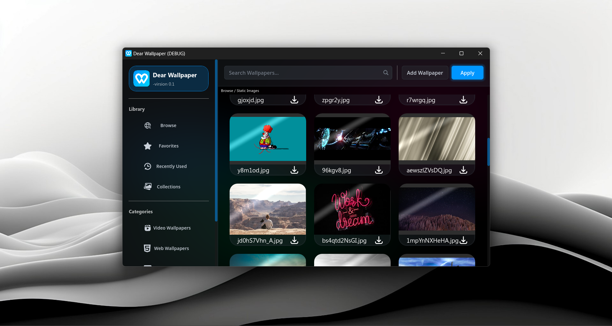

# Dear Wallpaper

**Dear Wallpaper** is an indie open-source, high-performance wallpaper engine built with **Godot**, **C++**, and **FFmpeg**.  
It allows you to create **interactive and dynamic wallpapers** using **videos**, **HTML**, **images**, and **custom shaders**.

---

## Features

- 🎬 **Video Wallpapers** — Play video backgrounds with FFmpeg decoding.  
- 🌐 **HTML & Web Wallpapers** — Render interactive web pages as live wallpapers.  
- 🖼️ **Image Wallpapers** — Display static or animated image backgrounds.  
- 🎨 **Shader Wallpapers** — Use custom shaders for fully dynamic and programmable visuals.  
- ⚙️ **Godot + C++ Integration** — Powered by a hybrid engine using GDExtension for performance and flexibility.  
- 🧩 **Modular System** — Easy to extend with new wallpaper types and rendering backends.  

---

## Development Note

Project development was **temporarily paused** due to technical issues related to **high-quality video rendering**.  
The main issue arises from **FFmpeg’s CPU-based YUV → RGB format conversion**, which causes **heavy load** and potential **crashes** during playback.

We’re working on improving performance by exploring:
- GPU-based color space conversion.
- Multi-threaded video decoding.
- Hardware acceleration pipelines (VAAPI, NVDEC, etc.).

---

## Tech Stack

| Component | Technology |
|------------|-------------|
| Engine | Godot (GDExtension) |
| Core Language | C++ |
| Video Processing | FFmpeg |
| UI / Controls | Godot UI System |
| Rendering | OpenGL / Vulkan (future) |

---

## License

This project is **open-source** and licensed under the **MIT License**.  
Feel free to use, modify, and distribute it under the terms of the license.

---

## Author

Developed by one person (me).

---

## Contact

Gmail: **[youelatek@gmail.com]**
Discord: **[El3tek]**

If you’re interested in this project or would like to help complete its development,
feel free to reach out — any contribution or idea is welcome!
